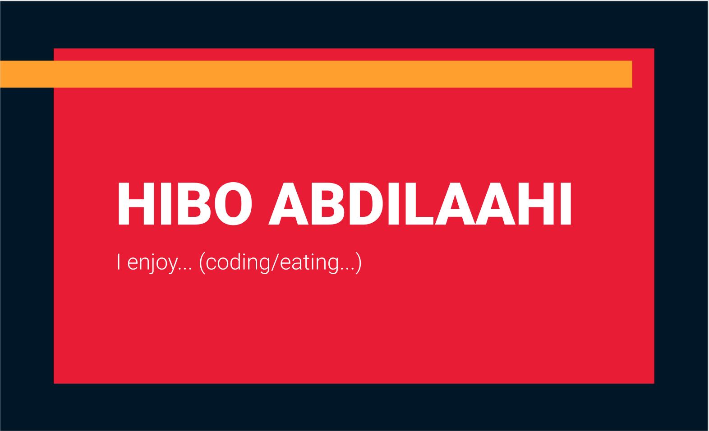

# Personal Website

[Placeholder for netlify status build]
[Placeholder for link to website]
[Placeholder for image of website]

## Process

I started off my creating a mock for a home page and designating my first sprint to making that home page. Before diving in, I wrote owner stories to structure my work and ensure I had a clear vision in mind. In terms of the tech stack, I decided to use react due to my previous experience with the framework.

## Plan

## User stories and mockups

### Home page

`As the owner,
So I can navigate the site easily,
I would like to have a navigation bar at the top of the page.
`

`As the owner,
So I can enable people to get into contact with me
I would like to display my contact links
`

`As the owner,
So people know who I am
I would like to display my name on the page
`

`As the owner,
So I can have a fun homepage
I would like the text below the name to have a typewriter effect
`

### Other

`As a user,
So I can show off my cool projects
I would like to have a portfolio page
`
