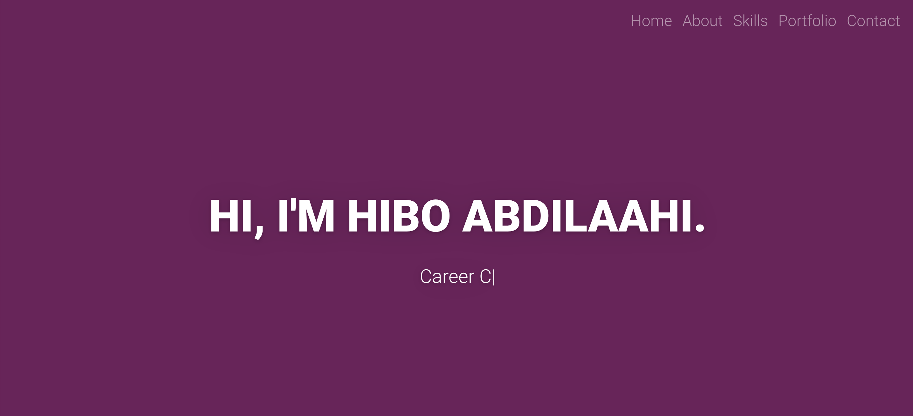

# Personal Website

[Live here](https://hibo-abdilaahi.netlify.app)

## Process

I started off my creating a mock for a home page and designating my first sprint to making that home page. Before diving in, I wrote owner stories to structure my work and ensure I had a clear vision in mind. In terms of the tech stack, I decided to use react due to my previous experience with the framework.

As time went on, I signed up to some additional projects and so had to stop additional work on this towards the end of July. However I plan to pick this up and the Further/future work section below outlines what I plan to do next.  

## Plan

## Owner stories

### Home page

`As the owner,
So I can navigate the site easily,
I would like to have a navigation bar at the top of the page.
`

`As the owner,
So I can enable people to get into contact with me
I would like to display my contact links
`

`As the owner,
So people know who I am
I would like to display my name on the page
`

`As the owner,
So I can have a fun homepage
I would like the text below the name to have a typewriter effect
`

### Other

`As the owner,
So I can show off my cool projects
I would like to have a portfolio page
`

`As the owner,
So people can get into touch with me
I would like to have a contact page with a form
`

`As the owner,
So I can let people know my technical skills
I would like to have a skills page
`

`As the owner,
So people can learn about me
I would like to have an about page
`

### Inital mockup

My first mockup is similar to the current homepage with the only omission being the image. I decided to move this image to the about page where it seemed more suited. I also would like to make the home page more dynamic in the future with different interactive elements and this is an additional reason to remove the image.

## Further/future work

I plan to continue to work on the following:
- Look into and solve the delay in response when submitting a request through the contact form.
- Improve the design to make it more interesting/interactive/dynamic.
- Add more projects, both those created and those in progress
